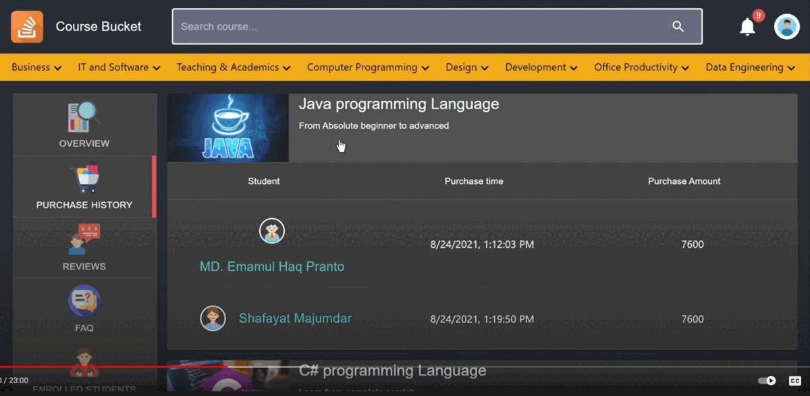
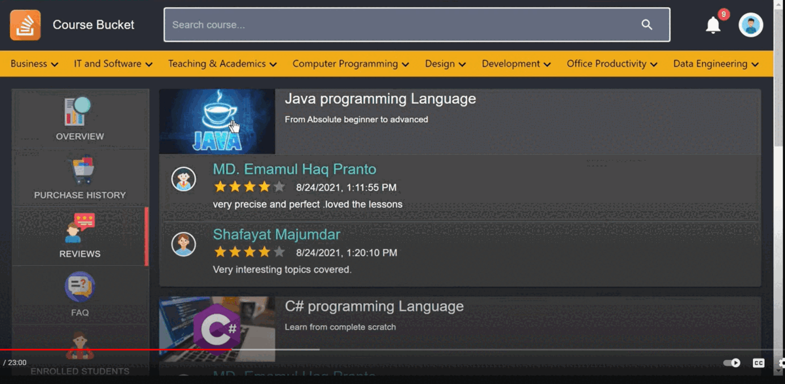

![React](https://img.shields.io/badge/therap_java_fest_2021-1st_Runner_UP-F72222?style=for-the-badge&logoWidth=30&logo=data:image/png;base64,iVBORw0KGgoAAAANSUhEUgAAAFEAAAAjCAYAAADsZeb8AAABS2lUWHRYTUw6Y29tLmFkb2JlLnhtcAAAAAAAPD94cGFja2V0IGJlZ2luPSLvu78iIGlkPSJXNU0wTXBDZWhpSHpyZVN6TlRjemtjOWQiPz4KPHg6eG1wbWV0YSB4bWxuczp4PSJhZG9iZTpuczptZXRhLyIgeDp4bXB0az0iQWRvYmUgWE1QIENvcmUgNS42LWMxMzggNzkuMTU5ODI0LCAyMDE2LzA5LzE0LTAxOjA5OjAxICAgICAgICAiPgogPHJkZjpSREYgeG1sbnM6cmRmPSJodHRwOi8vd3d3LnczLm9yZy8xOTk5LzAyLzIyLXJkZi1zeW50YXgtbnMjIj4KICA8cmRmOkRlc2NyaXB0aW9uIHJkZjphYm91dD0iIi8+CiA8L3JkZjpSREY+CjwveDp4bXBtZXRhPgo8P3hwYWNrZXQgZW5kPSJyIj8+IEmuOgAABuxJREFUaIHt2WuMXVUVB/Dfve200FYBaxmpSKtjqU5RUJD6TKMJX3zECKj4qBqUGB9Ro1HRROQRU6JETQyJgBoiqPhsUQwiUYqoKFTaSmpThBYtVsZOKbbF6WMefljn9O6z772dO51JM5PMP7m5Z69zzn6svR7/tU9NgQXnfc44sRjfxnFFux/vxFPj7XiyYuedq8DMCezzTLwuad+H/RPY/6RFfQL7OiNr/xZDE9j/pEVqic/HhePo621ZexkuzWT/ws0YGcc4kw6pEs/Hqgns+03FL8XtuGkCx5gUSN15+TEY765jMMYxR2qJfVirvasN4Rl4aSa7B914YSLvx0bNMXft0U918iJV4oc7eP4d+H7S3obX4ou4PJHfhE+Od3JTBWOlOK/I2hvbyH9f/C/BK4WlDmB9ci9FF14lMvw8YeHb8TvsSJ6bIahUF2rYi02Cm74RPYKX/qx473k4B6diFgbxqKBf/0z67cXThRfuL9Z1gjCQJcKjHsOvsTOf/FiUWMeLM9kDxYJSV/4fDuJ6vAtzsnduEFY/WLQvwmfwkhZj9uFr+LJY4DKxCbOL+9/FF/BDsVnpHM7AB/C0Fv3uwrXCe+bglzituPfHot9PCwWm2IZPYXUqHIsST8ILMtmfRaVySiKr40bMb9PPJbgb38M1xaTaoRtX43ix4N7iusQAfoyXJ7Kt+Jiw2HaYj8uwB7dhkbBsOAuvbvPec3GLKCr+UArHosTTcXLS3ou/CpPvSuTHFb+t+EkxxiWqFnGeSFKpAoewBuvwIsE7y/l9XsTiZcnzw1gp3D9F6bol/i0WvhNvVmUhHxQWXktkZX+birksxork/ixcVaxhiLEp8cxssMeKieXxEG7F+4XbwH9xRXJ/BS5I2gdxsbDOEhuEGxObtFIot0RdLHivsOhbRQy8HAvERu7DG/Bg8c61IgT1FO0FmrksfAOfFZYOV4qwUWK5sMqHGZsS85j1l+L/rEy+Hu8uFlBiR/bM4qx9o6oC4TqR4Z9VtM9XdWV4Am8VJSaREG4T65orrGxX8vwePJm0BzXHvTvxcVWqt0ocppTKnyM2bExKrGlW4gPF+72Z/EpVBRIZsh2G8QOhoNLSSxfr01Bib/Fsiks1FFjiUPHrwkKcixNF4jhbNVbWNJJUias1c+UBsUE9ieyk8qJTJZ4iNJ/ifpGV0wTSJ5JGirpqLGuFb2o+rKhrttiUvG9V5awlVuI9Ijuf7MiHLAOqcf4h/KnNs/n89pQXnSrxdFVl7REx60LB3Uo8iN3ZuwtUKVCOOpZ2OI8Ut6ueVc4QtOriNs8/KdabJqJBVSVvFvQox0xVIxrC4+nNTpDHvYeFy74sk9/X4t0lqhswrHniv9JsMcMa7l0TMWlBcj+3+AtUFTiEnwsOuEWQ62+JrEpYYV1VB7kBlOhR9aYdwhPQuRLzmLah+D87k69r8W4eS7cUkyppyP06KxHTo7YBjYxbIs32w4LQX5/I5qpm92FVLyL4Yiu8T+PEHu4VjAOdKbFV8lhXTCo18f2CN+bIlbhGhIEyK64QgT/NmjNF1fAcoWSqsWu7qB5SnJZclyQ8xUc0khRhdTnHXC4o272J7BzN5wo31+sNx+lEiQvFgW2JEaHEparu9XfBHVO0KhXXiMmXSlyE74gy65FirCvEYQetq4eNOJDJBpLruaIi+aqw+IuKdorZqqScoC63CIrzkDixWiXq6hJ3a4SfYTpTYq9qtbELf8N7s+c2aV7Yqaq0YHcxua8I9+wu5G8Rlc+jgsSekLyzTQTxlNSvbzHPu4o+SnxCZOpZmuvnEeGeczJZTVj0alEA5EreLSz6kIjzu+jsG0tuSY+IrPiaTN4qHvYKVy3xD5GQtguSvD25d6JIYKkCN4uEkpaVNIh+iuvE5qaYLxS4Dz9N5DVhrSmuwR1JO1dgOedNhSsfnlMnlnhu1i6V9XgxaLmDa1u8e7yoAIbEhv1G4/TmHuGqHxWl10JhHU+JjfqRSAwHhDX2F+OUxDfHf/B6YeUrhBIOiZh6lQg3XYV8hjj1SRW5WpSMl+HtwktKKvMLfF31+Oxw+DhcC7f57jxb7Hqa3j8kyPFEYjaeLWJPv6AQZXVSM/YPW88UrjqgxfmfKB42a1j9E6KSKWP6POHWB8XHtcMKSxJKre+OL40wuiUuUo1pI6Lcm2gckPCuDEfzZbB/lPvLVMPGVnHaU2Kf5tDQdl6jxcSlqvyoT/vFTiXkRcIG4/hGPpoS83i4RfVUZKoiT5atsn3HGE2J+WAbTf0P77NUT3KGtU5UHeNISpynuawb145NEvSoniHuFR521DhSYukWWas81TikNRecaugWVGVQUJ11Yp3TmMY0pjGNCcD/Ac7Xc2Uw6Q3DAAAAAElFTkSuQmCC&labelColor=F9D10A) 

 

# Course Bucket

       

## Video

## Description

As the world of internet progress, the need of online course contents increases day by day. In order to cope with the situations, we introduce our very project an online course offering platform called **COURSE BUCKET**. This website will provide all the necessary services regarding course creation, purchase and student-instructor communication.

## UI

#### Homepage

#### Account Settings

#### Overview

#### Purchase History

#### Review

#### FAQ

#### Enrolled Students

#### About Teacher

#### Create Course

#### Admin Panel

#### Student

#### Search Filter

#### Purchase Course

## Use Cases

1. **Registration :** We allow 2 kinds of registration namely Instructor and Student. Admin accounts are hard coded. And guest accounts are treated as unregistered account.
2. **Students Functionalities :**
    - Edit his account settings.
    - Purchase courses.
    - Review and rate any course.
    - Ask a question to the course instructor.
    - Message an instructor.
    - Can see his course purchase history
    - Can see his FAQs
    - Can see his ratings and reviews
    - Can access to his purchased course
	 
3. **Instructors Functionalities :**
    - Edit his account settings
    - Upload, delete or update his course.
    - Can see his created courses
    - Can see an overview of total revenue, enrollments, ratings, reviews and FAQs.
    - Can see his students.
    - Can see the sold courses details.
    - Can create a course.
    - Can message his students

4. **Admin Functionalities :**
    - Can see user list
    - Can see, approve and unapprove a course. 
    - Can update necessary database content.
    - Can edit category list.

5. **Search Course :** One can search a course based on his requirements.

6. **Filtering :** Filtering is also available to make searched courses more meaningful  to  the users

7. **Notification :** Admin, Students and Instructors can see notification on different events

## Guideline to Run the Project

### Backend

`1.` Create an oracle user.
username :  `coursebucket` password :  `cb`

`2.` Create a database connection if you are using a third party app

`3.` Grant all the privileges to the user

`4.` Open a sql file and run the query situated at database folder of the project

`5.` Open the back end folder in Eclipse IDE

`6.` Select `bucketApplication.java` file and run the server.

`7.` Open frontend folder in windows terminal

`8.` Type the command  `npm install` and wait for installation

`9.` Then type the command `npm start`

`10.` The app will take at max 5 minutes to fully run on your browser

### Frontend

`1.` In the frontend directory, run `npm install` to install all the packages.

`2.` Run `npm start` to start the frontend.

## Credit

  
  

